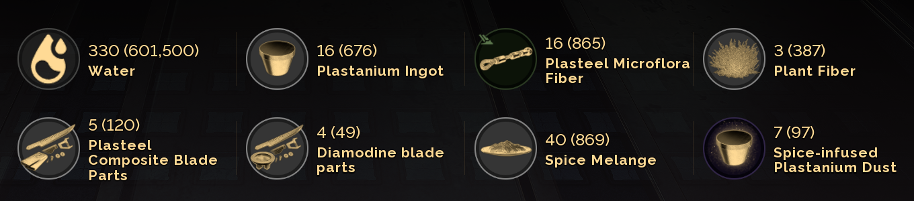

## Dune: Awakening Inventory Screenshot App (Windows, Python)

This Python app listens for a global hotkey (German **STRG+ALT+.**, i.e. `Ctrl+Alt+.`), captures a cropped area of the screen that contains an inventory/resource list associated with an item to be fabricated, and processes screenshots in the background using a queue system. Each screenshot is split into 8 tiles, pre-screened with Tesseract OCR, sent to a local vision LLM (Ollama), and the recognized items update a CSV file.

The app only works properly if the screenshot is taken while viewing any of the fabricators production screens. Below is an example screenshot crop.




**Key Features:**
- **Background processing**: Take multiple screenshots without waiting - they're queued and processed asynchronously
- **Queue system**: Screenshots are processed one at a time in a background worker thread
- **CSV updates**: Existing inventory items are updated (not duplicated) based on item name

The CSV file is called `inventory_log.csv` and will be created in the same folder as the script by default.

### Project Structure

The app is organized into a modular structure:

- `main.py` - Entry point with hotkey handling and queue processor initialization
- `inventory_app/` - Main package
  - `config.py` - Configuration proxy module (provides backward-compatible access to config values)
  - `config_manager.py` - Manages user-specific configuration files (JSON/YAML) and path persistence
  - `image_handler.py` - Screenshot capture, image splitting, OCR pre-screening, debug saving
  - `llm_client.py` - Communication with Ollama vision LLM API
  - `csv_handler.py` - CSV file operations (header management, reading/updating inventory data)
  - `queue_processor.py` - Background queue system for asynchronous screenshot processing
  - `ui.py` - Interactive configuration UI window with visual feedback

### 1. Prerequisites

- **Python 3.9+** installed and on your PATH.
- **Windows 10 or later** (tested on Windows).
- A running **Ollama** instance with a **vision model** installed (e.g. `qwen3-vl:8b`).

#### Install Tesseract OCR (used for pre-screening tiles)

1. Download the Tesseract OCR Windows installer from the official project (for example: `tesseract-ocr-w64-setup-*.exe`).
2. Install it, keeping note of the installation path, e.g.:
   - `C:\Program Files\Tesseract-OCR\tesseract.exe`
3. After installation, configure the Tesseract path in the UI (see Configuration section below) or in your config file.

### 2. Install Python dependencies

In a terminal opened in the project folder:

```bash
pip install -r requirements.txt
```

This will install:

- `keyboard` – global hotkey listener
- `mss` – fast screenshots
- `Pillow` – image handling
- `requests` – HTTP client for talking to Ollama
- `pytesseract` – OCR wrapper for Tesseract (used only to check if a tile contains text)
- `pyyaml` – Optional YAML support for configuration files (install with `pip install pyyaml` if you want to use YAML config files)

> On some systems, the `keyboard` package may require running the terminal as administrator to receive global key events.

### 3. Run the app

From the project directory:

```bash
python main.py
```

**By default, this opens a configuration UI window** where you can:
- Select and manage your configuration file (JSON or YAML format)
- Configure all settings interactively (hotkey, monitor, crop region, CSV path, etc.)
- Select monitor with visual feedback overlay
- Select crop region with interactive rectangle selector
- View current crop region with visual overlay
- Click "Start App" to launch the hotkey listener and background processing

The app remembers your last used configuration file location across restarts.

**Command-line options:**

- **Help**:

  ```bash
  python main.py --help
  ```

- **Start app directly (skip UI)**:

  ```bash
  python main.py --no-ui
  ```

  Starts the app in console mode without showing the UI window (legacy behavior).

- **Verbose/debug output**:

  ```bash
  python main.py --verbose
  ```

  Or combine with UI:

  ```bash
  python main.py --verbose --no-ui
  ```

**When you click "Start App" in the UI**, the app will start in the background. You'll see console output similar to:

```text
Inventory Screenshot App
========================
Hotkey: ctrl+alt+.  (German STRG+ALT+.)
CSV file: inventory_log.csv
LLM API URL: http://localhost:11434/api/generate
✓ Background queue processor started
✓ Hotkey 'ctrl+alt+.' registered successfully.
Press the hotkey to capture and process a screenshot.
Press Ctrl+C in this terminal to exit.
```

**Note:** You can close the UI window after starting the app - it will continue running in the background. The console window will show all activity.

**Configuration File:**
- The app uses user-specific configuration files (JSON or YAML) stored separately from the code
- By default, it looks for `config.json` in the project directory
- You can select a different config file using the UI's "Browse..." button
- The last used config file path is saved in `.last_config_path` and automatically loaded on startup
- Configuration files are not tracked in git (see `.gitignore`)

Now:

1. Bring your inventory / resource UI onto the screen (on the monitor selected in the UI).
2. Make sure the configured crop rectangle covers the "Resources Required" panel area (use "Show Crop Area" button in UI to visualize it).
3. Press **STRG+ALT+.** (`Ctrl+Alt+.`) or your configured hotkey.
4. You'll immediately see: `"Screenshot queued as task #1 (1 task(s) in queue)"` - the screenshot is captured and queued instantly.
5. **You can press the hotkey multiple times** without waiting - each screenshot gets queued with a unique task ID.
6. In the background, each task is processed:
   - The captured image is split into **8 tiles** arranged in a **4×2 grid** (4 columns, 2 rows).
   - For each tile, run **Tesseract**; if it detects no text, that tile is skipped.
   - For the remaining tiles, send each tile **individually** to the configured **Ollama vision model** with a JSON-only prompt.
   - Parse the JSON responses and **update** `inventory_log.csv` (existing items are updated, new items are added).
7. When each batch completes, you'll see: `"Task #N: Updated CSV with X items (took Y.Ys)"`

### 4. Configuration UI

The configuration UI provides an interactive way to manage all settings:

**Config File Management:**
- **Browse...**: Select an existing config file (JSON or YAML) to load
- **Reload Config**: Reload the currently selected config file
- The config file path can be edited directly or selected via the file browser
- Changes are saved when you click "Save Config"

**Monitor Selection:**
- Buttons for each available monitor are displayed in a 2-row grid
- Click a monitor button to select it - a visual overlay will appear on that monitor for 3 seconds
- The selected monitor is highlighted in light green

**Crop Region Selection:**
- **Show Crop Area**: Displays the current crop rectangle as a red overlay on the selected monitor (press ESC to close)
- **Select Crop Area**: Opens an interactive overlay where you:
  - Click once to set the top-left corner
  - Move mouse to see a preview rectangle
  - Click again to set the bottom-right corner
  - Use "Accept" to confirm or "Discard" to cancel
  - Press ESC at any time to cancel
- The overlay can be minimized to access the UI window

**Other Settings:**
- Hotkey: Edit the keyboard shortcut
- Save Debug Images: Toggle saving of debug screenshots
- CSV File Path: Set where inventory data is saved
- Tesseract Executable: Path to Tesseract OCR
- Ollama API URL: LLM API endpoint
- LLM Model Name: Vision model to use

**Keyboard Shortcuts:**
- **ESC**: Close any active overlay (crop region display or selection) from the main UI window

### 5. How the vision / OCR pipeline works

- The crop region is defined in your configuration file and is relative to the chosen monitor.
- The captured image (default 1360×300 on a 2560x1440 display) is split by `split_image_into_subimages` into 8 tiles in a **4×2 grid**.
- Each tile is passed to `image_has_text`:
  - Converts to grayscale.
  - Uses `pytesseract.image_to_string(..., lang="eng")`.
  - If the result contains any alphanumeric characters, the tile is considered to contain text.
  - Tiles without text are **not** sent to the LLM.
- The remaining tiles are sent one-by-one to Ollama (`qwen3-vl:8b` by default), using a prompt that asks for:

  - `item_name` (string, or `"NONE"` for empty tiles)
  - `required_count` (integer or `null`)
  - `available_count` (integer or `null`)

The model is instructed to return **only valid JSON** so the app can parse it directly.

### 6. CSV output and queue system

`inventory_log.csv` has the header:

```text
timestamp,item_name,available_count,required_count
```

Where `required_count` is only a momentary snapshot of the current item to fabricate when taking the screenshot. It can be ignored for now.

**CSV Update Behavior:**
- The CSV file is **updated** (not appended) - existing items with the same `item_name` are updated with new counts and timestamp
- New items are added as new rows
- Items are sorted alphabetically by `item_name` for consistency
- Each completed task updates the CSV file once with all its recognized items

**Queue System:**
- Screenshots are captured instantly and queued for background processing
- Tasks are processed sequentially (one at a time) to avoid overwhelming the LLM API
- Each task has a unique ID for tracking progress
- The queue size is shown when screenshots are captured
- CSV updates are thread-safe (protected by locks) to prevent data corruption

You can open the CSV file in Excel, LibreOffice, or any CSV tool to analyze your inventory over time. The file is updated after each batch completes, so you can monitor changes in real-time.

### 7. Notes and customization

**Configuration Files:**
- Configuration is stored in user-specific JSON or YAML files (not in the code)
- Default location: `config.json` in the project directory
- You can create multiple config files for different setups
- The app remembers your last used config file path in `.last_config_path`
- Config files are excluded from git (see `.gitignore`)

**Customization via UI:**
- All settings can be configured through the UI - no need to edit code
- **CSV file location**: Set in the "CSV File Path" field
- **Screenshot region**: Use "Select Crop Area" to interactively define the crop rectangle
- **Monitor selection**: Click monitor buttons to select (visual feedback provided)
- **Hotkey**: Edit the hotkey field (e.g., `ctrl+shift+i`)
- **Ollama model**: Change `MODEL_NAME` to any compatible vision model (e.g. `llama3.2-vision`, `qwen2.5vl:7b`, etc.)
- **Ollama API key**: Enter your API key (if your Ollama endpoint requires Bearer token auth)
- **Tesseract path**: Set the path to your Tesseract executable

**Manual Configuration (Advanced):**
If you prefer to edit config files directly, they use this structure:

```json
{
  "hotkey": "ctrl+alt+.",
  "monitor_index": 1,
  "crop_region": {"left": 835, "top": 900, "width": 1360, "height": 300},
  "save_debug_images": false,
  "csv_path": "inventory_log.csv",
  "tesseract_cmd": "C:\\Program Files\\Tesseract-OCR\\tesseract.exe",
  "ollama_url": "http://localhost:11434/api/generate",
  "ollama_api_key": "",
  "model_name": "qwen3-vl:8b"
}
```

**Monitor Selection Notes:**
- `1` = primary monitor (default)
- `0` = all monitors combined (virtual desktop)
- `2`, `3`, ... = specific monitor index reported by `mss`
  
Windows display enumeration is not always consistent and can change between reboots, or even after wake-up from suspend mode. Especially in case of more complex multi-monitor setups.

**Debugging:**
- Use `--verbose` flag to see:
  - Queue status and task processing details
  - OCR snippets from each tile
  - Which tiles were skipped by OCR
  - Per-image LLM calls and results
  - CSV update operations (what was updated vs. added)
- Enable "Save Debug Images" in the UI to save all captured images and tiles for inspection

If you adjust your UI layout (different size, different number of tiles), we can update the crop region and the grid splitting logic to match.  
If you share an updated screenshot and the exact values you expect in CSV, we can further refine the prompt and parsing.
